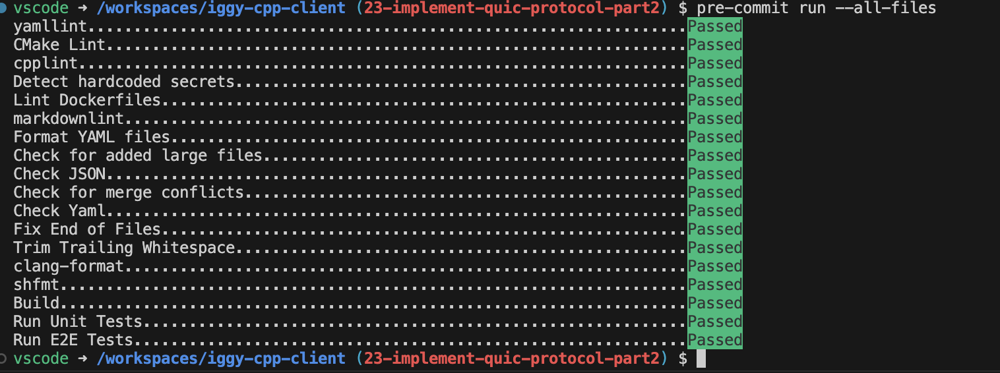
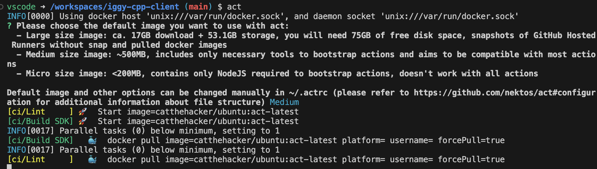

# Contributing to iggy-cpp-client

## Introduction

This is a collection of tips for developers of `iggy-cpp-client`. The initial code is being built with the latest Visual Studio Code and its C++ dev container, under `.devcontainer`. If you are using CLion, XCode or other toolchains it may not have been tested, so please report issues and we will fix them. We are also currently using [vcpkg](https://vcpkg.io) in [manifest mode](https://learn.microsoft.com/en-us/vcpkg/users/manifests) for dependency management. The appropriate packages are downloaded and compiled locally as part of the CMake build, but if you add a new dependency extra steps are required to update the manifest and CMake configuration.

## Philosophy: code quality

In VS Code the dev container automatically installs [pre-commit](https://pre-commit.com), sets up the `.git` hooks directory and installs all necessary tools for pre-commit checks. The relevant linters from [super-linter](https://github.com/super-linter/super-linter) -- which runs in CI automatically -- as well as the build, unit tests ad E2E tests are all run for you on any changed files before any local Git commit, _before_ it gets pushed. This is in line with the general project philosophy to do as many quality checks and fixes left-of-merge, meaning we aim to catch problems first in the IDE, then in pre-commit checks, and finally in mandatory checks run in CI before the developer ever merges a code change to the `main` branch. This is born of hard experience that quality problems, once merged in, are much harder to repair. Not only is the problem out of context ("which of the last 20 commits caused this E2E test regression?") but accountability is lost: the person who has broken a test, introduced a warning or violated coding standards _must_ be the one to fix the problem. "Quality control is everyone's problem" is not enough: applied literally, quality is nobody's problem, so this is better understood as a requirement that everyone own the impact of the changes they themselves make to the codebase to the maximum extent possible.

## Tested configurations

CI runs on `ubuntu-latest`, and the dev containers have been tested on both x64 and arm64 (macOS 14.x, using latest VS Code and Docker Desktop). CLion, XCode and other C++ IDE's will be supported on a best-efforts basis.

## HOWTO: Run pre-commit checks manually

When adding new pre-commit checks or when testing out other development environment changes, you may wish to pro-actively run all pre-commit checks on all files. You can do it this way:

```shell
pre-commit run --all-files
```



## HOWTO: Upgrade vcpkg dependencies

We freeze the dependency versions with a fixed baseline in `vcpkg-configuration.json`. To upgrade to the latest versions and view them, run:

```shell
vcpkg x-update-baseline
vcpkg install
vcpkg list
```

then commit the upgrade.

## HOWTO: Test GitHub Actions locally

Our continuous integration uses GitHub Actions, and sometimes it's more convenient to first test it. The VS Code container includes the [act](https://github.com/nektos/act) extension, and you can use it to do a smoke test of the CI actions before you push to GitHub. Run `act` and, if running for the first time, choose "Medium" for the container:



Note `act` is an _emulator_ that runs in Docker. It may not perfectly reproduce the GitHub Actions environment, and is not a substitute for a full CI run on GitHub post-commit.

## Resources

- VS Code C++ support: [https://code.visualstudio.com/docs/languages/cpp](https://code.visualstudio.com/docs/languages/cpp)
- `vcpkg`: [https://vcpkg.io](https://vcpkg.io)
- `act` GitHub Action runner: [https://github.com/nektos/act](https://github.com/nektos/act)
